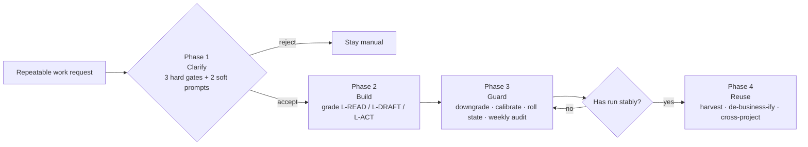
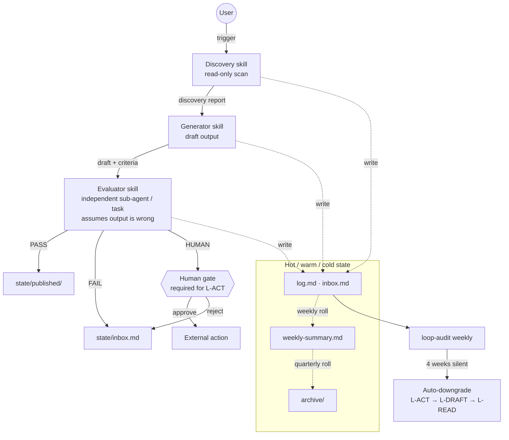

# Loop Engineering v2.2

[](./LICENSE)
[](./CHANGELOG.md)
[](./adapters/)
[](#project-status)
[](https://github.com/zhuqquan-dot/loop-engineering/stargazers)

A complete Loop Engineering methodology package for people who want to make AI agents run repeatable work with structure, skepticism, and brakes.

This repository is designed for cross-agent use with **Claude Code**, **OpenAI Codex**, **Cursor**, **Trae**, and other agentic coding environments. It keeps the full methodology intact. It is not a minimal starter kit. It is for users who actually want the full discipline.

## Table of contents

- [Project status](#project-status)
- [What this is](#what-this-is)
- [How it works in one picture](#how-it-works-in-one-picture)
- [Who this is for](#who-this-is-for)
- [What problem it solves](#what-problem-it-solves)
- [What it does not claim](#what-it-does-not-claim)
- [Design goals](#design-goals)
- [Core concepts](#core-concepts)
- [Repository structure](#repository-structure)
- [How to use this repository](#how-to-use-this-repository)
- [Supported agent environments](#supported-agent-environments)
- [Recommended reading order](#recommended-reading-order)
- [When to use it](#when-to-use-it)
- [Why the full methodology remains intact](#why-the-full-methodology-remains-intact)
- [License and attribution](#license-and-attribution)
- [Version](#version)

## Project status

This is a **methodology and documentation project**, not a runtime, library, or hosted service.

- There is no npm/pip package and no deploy step.
- The only executable surface is two installer scripts ([`install.sh`](./install.sh) / [`install.ps1`](./install.ps1)) that copy local files into your own agent's skill directory.
- Versioned changes are tracked in [`CHANGELOG.md`](./CHANGELOG.md). The methodology core is intentionally stable; most updates land in adapters, examples, and documentation.
- Issues and PRs are welcome — see [`CONTRIBUTING.md`](./CONTRIBUTING.md), [`SECURITY.md`](./SECURITY.md), and [`CODE_OF_CONDUCT.md`](./CODE_OF_CONDUCT.md).

## What this is

**Loop Engineering** is a method for turning repeatable AI work into a controlled loop instead of a loose conversation.

This repository does not teach a model how to write code, summarize markets, or draft messages. It defines how to decide whether a task should become a loop, how to structure the loop, how to separate generation from evaluation, how to preserve state without polluting context, and how to keep human control over consequential actions.

The core idea is simple:

- not every task deserves a loop
- repeated work needs structure
- generated output should not judge itself
- external actions need a human gate
- long-running loops must compress memory or they rot

## How it works in one picture

The four-phase lifecycle:



The runtime topology of a single loop:



## Who this is for

This project is for people who:

- repeatedly use AI agents for similar work
- want a reusable operating method instead of ad hoc prompting
- need a shared discipline across multiple agents or platforms
- care more about reliability than novelty
- are willing to use the full method instead of only the lightest version

This project is not optimized for people who only want a one-line prompt or a casual quick hack.

## What problem it solves

Most agent workflows fail in familiar ways:

- tasks that should stay manual get over-automated
- draft output gets mistaken for finished output
- the same agent generates and self-approves
- long projects accumulate noisy logs and stale context
- platform-specific tricks get confused with durable method

This repository solves those problems by introducing a stable structure:

1. a gate before looping
2. a risk-based grading model
3. generator and evaluator separation
4. explicit state files
5. human approval for external action
6. long-run maintenance and downgrade rules

## What it does not claim

This repository does not claim that:

- every task should use Loop Engineering
- every platform can auto-switch models
- every loop should be fully automated
- evaluators are always different models
- the method removes human judgment

The method is intentionally conservative. Structure matters more than magic.

## Design goals

The repository is built around these goals:

- **Agent-agnostic**: the method should survive platform changes
- **Model-agnostic**: model switching is optional, structural separation is primary
- **Platform-agnostic**: the core rules should not depend on one vendor feature
- **Human-in-the-loop**: irreversible actions must remain gated by a person
- **Progressive execution**: run manually before scheduling, schedule before cloud automation
- **State discipline**: memory lives in files, not in endless chat context

## Core concepts

### 1. The 3-level grading model

- **L-READ**: read-only loops
- **L-DRAFT**: internal drafts or local file writing without external action
- **L-ACT**: external actions, production data changes, publishing, sending, merging, calling outside systems

If the level is unclear, move one level higher.

### 2. Generator and evaluator separation

For **L-DRAFT** and **L-ACT**, the generator and evaluator must be separated as independent agents or independent tasks.

The evaluator should assume the output is wrong unless it is proven good enough. Different models are recommended when practical, but they are not mandatory. The non-negotiable rule is structural separation.

### 3. Human gate

If a loop sends, publishes, merges, updates production state, or triggers an external system, the final step must be held behind human approval.

### 4. Hot / warm / cold state

Long-running loops cannot keep everything in active context.

- hot: recent operational state
- warm: compressed weekly summaries
- cold: archived history that agents should not read by default

## Repository structure

```text
loop-engineering-v2.2/
├── SKILL.md
├── README.md
├── CHANGELOG.md
├── LICENSE
├── CONTRIBUTING.md
├── install.sh / install.ps1
├── uninstall.sh / uninstall.ps1
├── docs/
│   ├── README.md
│   ├── philosophy.md
│   ├── quickstart.md
│   ├── grading.md
│   ├── evaluator.md
│   ├── memory.md
│   ├── anti-patterns.md
│   └── faq.md
├── references/
├── templates/
├── adapters/
└── examples/
```

Direct entry points:

- [SKILL.md](./SKILL.md) — agent-readable methodology entry point
- [docs/](./docs/) — public-facing narrative (start with [docs/quickstart.md](./docs/quickstart.md))
- [references/](./references/) — implementation rules and edge cases
- [templates/](./templates/) — reusable starter skills and state files
- [adapters/](./adapters/) — platform-specific mappings
- [examples/](./examples/) — concrete cases
- [CHANGELOG.md](./CHANGELOG.md), [CONTRIBUTING.md](./CONTRIBUTING.md), [LICENSE](./LICENSE)

## How to use this repository

There are two ways to use it.

### One-line install (recommended)

The repository ships with [`install.sh`](./install.sh) (macOS / Linux / WSL) and [`install.ps1`](./install.ps1) (Windows PowerShell) that copy the methodology into the right location for each supported agent.

```bash
# macOS / Linux / WSL
chmod +x install.sh uninstall.sh   # only needed once after the first clone

./install.sh claude-code --scope global --with-rules
./install.sh codex --scope project --project-dir ~/work/my-app --with-state --with-rules
./install.sh cursor --project-dir ~/work/my-app --with-rules
./install.sh trae --scope global
./install.sh <target> --dry-run        # preview without writing anything
```

```powershell
# Windows PowerShell
.\install.ps1 -Target claude-code -Scope global -WithRules
.\install.ps1 -Target codex -Scope project -ProjectDir 'C:\work\my-app' -WithState -WithRules
.\install.ps1 -Target cursor -ProjectDir 'C:\work\my-app' -WithRules
.\install.ps1 -Target trae -Scope global
.\install.ps1 -Target <target> -DryRun  # preview without writing anything
```

| Target | Global path (`--scope global`) | Project path (`--scope project`) |
|---|---|---|
| `claude-code` | `~/.claude/skills/loop-engineering/` | `<project>/.claude/skills/loop-engineering/` |
| `codex` | `~/.codex/skills/loop-engineering/` | `<project>/.codex/skills/loop-engineering/` |
| `cursor` | _not supported_ | `<project>/.cursorrules` (+ optional `state/`) |
| `trae` | `~/.trae-cn/skills/loop-engineering/` | `<project>/.trae/skills/loop-engineering/` |

To uninstall, use [`uninstall.sh`](./uninstall.sh) / [`uninstall.ps1`](./uninstall.ps1) with the same `target` and `scope`.

### Manual use (skill package or open-source methodology repository)

Use [`SKILL.md`](./SKILL.md) as the agent-readable entry point, and keep the supporting documents beside it. Or treat the entire repo (including [docs/](./docs/), [adapters/](./adapters/), [templates/](./templates/), [examples/](./examples/)) as a public operating manual that others can read, fork, and adapt.

## Supported agent environments

This repository currently includes adapter guidance for:

- **Claude Code**
- **OpenAI Codex**
- **Cursor**
- **Trae / Trae Worker**

The adapters explain how the same method maps onto different runtime environments. The method stays stable; the implementation surface changes.

## Recommended reading order

If you are new to the repository:

1. [README.md](./README.md)
2. [SKILL.md](./SKILL.md)
3. [docs/quickstart.md](./docs/quickstart.md)
4. [docs/grading.md](./docs/grading.md)
5. [docs/evaluator.md](./docs/evaluator.md)
6. [adapters/README.md](./adapters/README.md)
7. your platform adapter ([Claude Code](./adapters/claude-code.md) · [Codex](./adapters/codex.md) · [Cursor](./adapters/cursor.md) · [Trae](./adapters/trae.md))

If you are implementing a real loop:

1. [SKILL.md](./SKILL.md)
2. [references/01-clarify-3plus2.md](./references/01-clarify-3plus2.md)
3. [references/02-build-spec.md](./references/02-build-spec.md)
4. [references/03-guardrail.md](./references/03-guardrail.md)
5. [templates/](./templates/)
6. [examples/](./examples/)

## When to use it

Use this method when:

- the same class of work happens repeatedly
- the output can be checked against observable standards
- the downside of getting it wrong is manageable or gated
- you want a reusable cross-project operating pattern

Do not use it when:

- the task is one-off and cheap to verify manually
- the work is highly emotional or deeply personal
- the task is a major judgment call that should stay human-led
- the cost of adding process is higher than the cost of occasional error

## Why the full methodology remains intact

This repository keeps the complete methodology by design.

It does not simplify itself for broad popularity. Open source does not require minimalism. It requires clarity, boundaries, and truthful claims. This package is intentionally complete so that suitable users can adopt it as a real operating discipline.

## Suggested open-source positioning

If you publish this on GitHub, position it as:

> A full Loop Engineering methodology for cross-agent AI work: design the loop, separate generation from evaluation, preserve state outside chat, and keep humans in control of external action.

That is a more truthful framing than calling it a universal automation framework.

## License and attribution

Author: **zhuquan**

Released under the [MIT License](./LICENSE).

## Version

Current package version: **v2.2**
