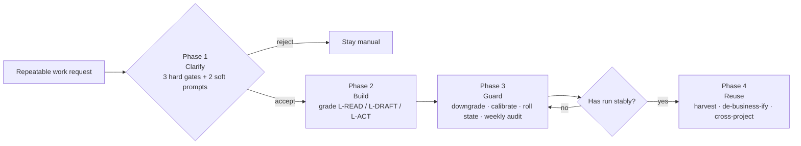
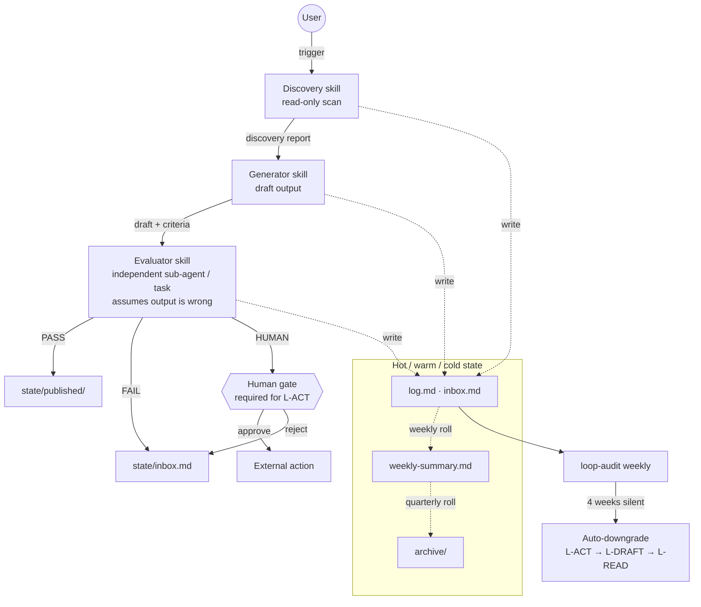

# Design Philosophy

This document explains *why* the Loop Engineering methodology is structured the way it is, not just *what* it prescribes. If you are evaluating whether to adopt it, start here.

## The shape of the method

Two diagrams summarize the entire design before we talk about it.

**Lifecycle**: a candidate task moves through four phases, and is allowed to be rejected at every phase.

**Runtime topology**: a single loop is split into discovery, generation, evaluation, and human gate, with state files compressed in the background.

The rest of this document explains why each piece of those diagrams exists.

## The core problem

Most agent failures in repeated workflows are not caused by a weak model. They are caused by a missing structure.

The same five patterns appear across platforms and teams:

1. **Over-automation**: tasks that should stay manual get turned into unsupervised loops
2. **Self-approval**: the same agent generates output and then reviews its own work
3. **Context decay**: long-running projects accumulate logs that eventually crowd out real task space
4. **Silent drift**: a loop keeps running while no one watches, and quality degrades without anyone noticing
5. **Platform lock-in**: operating methods get tangled with a specific agent's features, making them non-transferable

Loop Engineering addresses these by introducing structure that is independent of any single model or platform.

## Why structure, not magic

A better model does not fix a bad operating pattern.

If the generator self-reviews, a more capable model will produce more convincing justifications for its own output — not better judgments. If a loop runs unattended for months, a smarter model will still drift because no one is reading the results.

The methodology deliberately keeps the structure conservative: it errs on the side of more gates, more separation, and more human involvement — not less.

## Why grading matters more than rules

Not every task deserves the same level of discipline.

A daily competitor scan stored on your local machine does not need the same safeguards as an automated email campaign. Forcing the same process onto both tasks makes the light ones feel heavy and the heavy ones feel insufficiently guarded.

The three-tier grading model (L-READ / L-DRAFT / L-ACT) exists so that process intensity matches risk, not dogma.

## Why generator and evaluator must be separate

This is the single most important structural rule in the methodology.

A generator evaluating its own output is not performing evaluation — it is performing self-narration. It sees the reasoning that led to the result, not the result as a reader would see it.

Structural separation (independent agents or independent tasks) is the minimum requirement. Different models are a useful upgrade, but they are secondary. The primary value is that the evaluator starts cold, without the generator's reasoning momentum.

## Why human gates remain for external action

Automated external action is the fastest path to irreparable damage in an agent workflow.

Sending, publishing, merging, and calling outside systems all cross a boundary that cannot be undone by rolling back a file. The methodology insists that these actions stay behind human confirmation — not because humans are smarter, but because humans carry accountability that a model cannot hold.

## Why state files, not chat memory

Chat context is ephemeral. It is lost when the session ends, and even within a session, older messages get compressed or truncated by context window mechanics.

State files in a file system are the only durable record that survives across runs, across restarts, and across platform migrations.

## Why memory must be compressed

Long-running loops have a hidden failure mode: as the log grows, the agent reads more history and has less room for the current task. Over months, this turns a functioning loop into one that is reading its own past instead of working on the present.

The hot-warm-cold model is a compression discipline. It is not optional for loops that run beyond a few weeks.

## What the methodology is not

It is not:
- A universal automation framework
- A replacement for human judgment
- A way to make models smarter
- A guarantee of correctness
- A minimal starter kit

It is a conservative operating discipline for people who want repeatable agent workflows with structure, brakes, and accountability.
